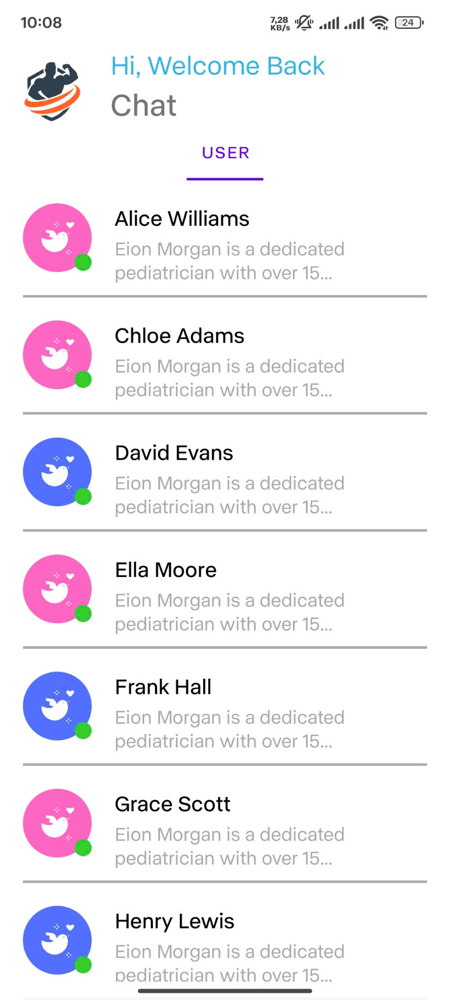
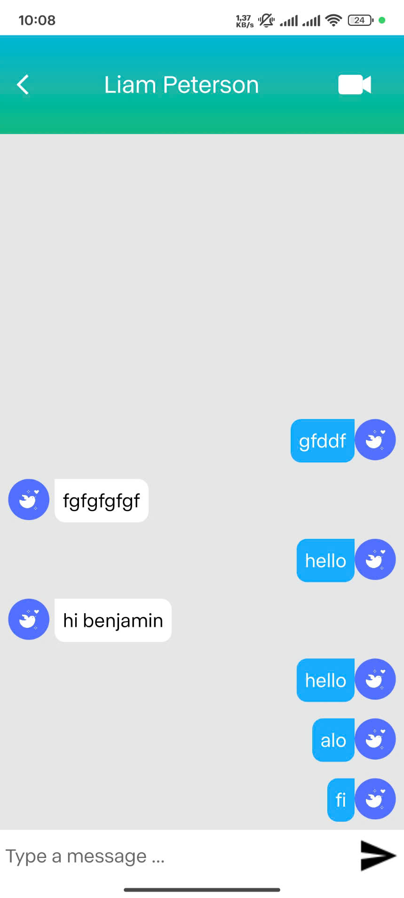
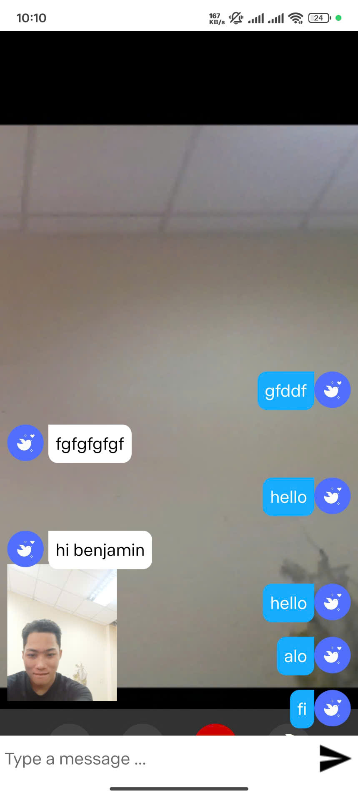

# FITMEET: Fitness Meeting and Scheduling Mobile Application

FITMEET is an Android application designed to help users book personal training sessions with fitness coaches. It integrates real-time video calls for training sessions using WebRTC and a chat feature powered by Spring WebSocket.

---

## Features

- **Booking System:** Users can schedule fitness training sessions with their preferred coaches.
- **Real-time Video Calls:** High-quality video calls powered by WebRTC and Firebase.
- **Chat Messaging:** Instant messaging between users and coaches using Spring WebSocket.
- **Coach Management:** Coaches can manage their availability and session bookings.
- **Notifications:** Push notifications for booking reminders and chat updates.
- **User Authentication:** Secure login and registration.
- **Data Storage:** MySQL database for user data, session logs, and bookings.

---

## Tech Stack

- **Frontend:** Android (Java) using Android Studio
- **Backend:** Spring Boot
- **Database:** MySQL
- **Real-time Communication:** WebRTC (for video calls) and Spring WebSocket (for chat)
- **Cloud Services:** Firebase (for video calls)

---

## Installation

### Backend Setup

1. **Clone the repository:**
   ```bash
   git clone https://github.com/luana2322/FitMeet.git
   ```

2. **Configure application.properties in the backend directory:**
   ```properties
   spring.datasource.url=jdbc:mysql://localhost:3306/fitmeet
   spring.datasource.username=your-username
   spring.datasource.password=your-password
   spring.jpa.hibernate.ddl-auto=update
   ```

3. **Build and run the backend server:**
   ```bash
   cd backend
   ./mvnw spring-boot:run
   ```

### Frontend Setup

1. **Open the project in Android Studio:**
   - Navigate to the `android` directory of the project.
   - Open it in Android Studio.

2. **Configure Firebase:**
   - Download the `google-services.json` file from your Firebase console.
   - Place it in the `app` directory of your Android project.

3. **Build and run the application:**
   - Connect an Android device or start an emulator.
   - Click "Run" in Android Studio.

---

## Usage

1. **User Registration:**
   - Sign up or log in using the secure authentication system.

2. **Booking a Session:**
   - Browse available coaches and select a time slot.

3. **Starting a Video Call:**
   - Join the session at the scheduled time. WebRTC handles the video call via Firebase.

4. **Messaging:**
   - Use the chat feature to communicate with the coach before and after sessions.

5. **Notifications:**
   - Receive push notifications for reminders and updates.

---

## Screenshots

<p align="left">
   
   
   
   
</p>

---

## Languages and Tools


<p align="left">
  <a href="https://developer.android.com" target="_blank" rel="noreferrer">  </a>
  <a href="https://spring.io" target="_blank" rel="noreferrer">  </a>
  <a href="https://www.mysql.com" target="_blank" rel="noreferrer">  </a>
  <a href="https://webrtc.org" target="_blank" rel="noreferrer">  </a>
  <a href="https://firebase.google.com" target="_blank" rel="noreferrer">  </a>
  <a href="https://www.jetbrains.com/idea/" target="_blank" rel="noreferrer">  </a>
  <a href="https://developer.android.com/studio" target="_blank" rel="noreferrer">  </a>
</p>


---

## License

This project is licensed under the MIT License. See the LICENSE file for details.

---

## Contact

- **Email:** nguyenbaoluanthai@gmail.com
- **GitHub:** [FitMeet](https://github.com/luana2322/FITMEET)


